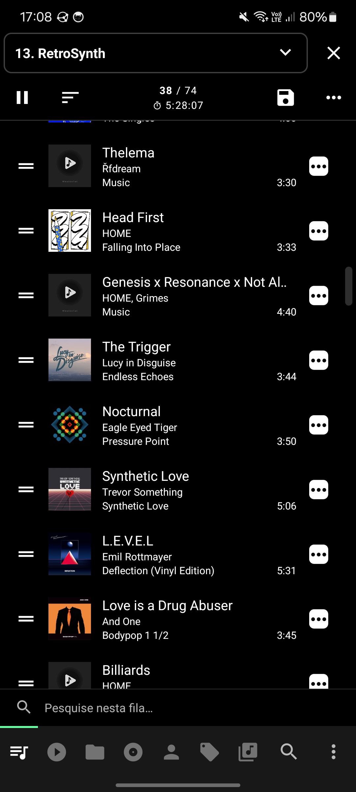
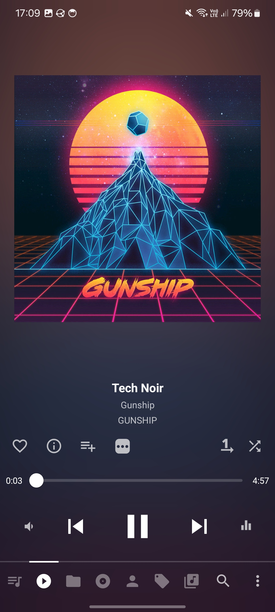

# App Clone

### Exercício individual - React-Native

#### Exercício realizado na matéria de react-native da Residência em TIC do Serratec

Aplicativo clonado: player de música offline <a href="https://play.google.com/store/apps/details?id=in.krosbits.musicolet&hl=pt_BR&pli=1">Musicolet<a/>

